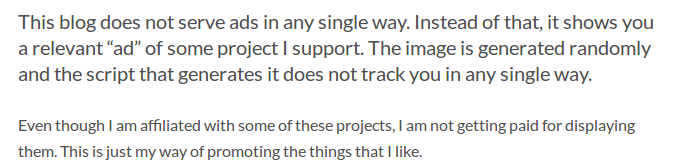

Let us be honest for a second: unless you're running a huge website (as in, tens of thousands of visits per day), you're not going to make a reasonable amount of money by serving ads on your websites. Even if you are getting tens of thousands of visits per day, your profit depends on how many of your visitors are not using some sort of adblocking software. The Internet is one of the rare platforms where users have a choice of hiding the ads if they don't want to see them, and the users are choosing not to see them in the alarming rate. So, if you can't make a meaningful amount of money out of them, why not ditch them all and start promoting the projects you support instead?

## Main reasons about why have I decided to reject the idea of showing ads

#### 1. Nobody profits from showing me ads.

I've started using [AdBlock Plus](https://adblockplus.org/) not long after I got my Internet connection (which was about 6 or 7 years ago). I've started using the Internet without seeing any ads. I did not feel bad about it, partially because I haven't fully understood how those things worked and partially because I wasn't seeing 50 articles per month about how adblockers are destroying the Web like I do now. Nobody ever profited from showing me ads and it feels completely cynical for me to try profiting from serving ads to others.

#### 2. Ads are meaningless and nobody ever clicks on them.

Unless Google's AdSense knows a lot about your visitors, your visitors are not going to see relevant ads. Therefore, the chances of them clicking on ads is rather small. Now, if Google knows a lot about your visitors, then Google will show them relevant ads. But, it's up to you to put them in some place where people will actually see them. If you put them in the middle of the content, everyone is just going to scroll over them and read the rest of the content (because people generally do not want to stop reading one thing and then click on an ad and start reading about whatever the ad is about). If you put the ad below the content, it's not very visible because your visitors usually don't care about what's below your content. If you put them above the content, people will just scroll through it to read the content because the sole reason why they clicked on the link to your website is to read that content. And, if you put your ad above the content, again, people will just scroll through them because they're on your website to read your content.

#### 3. People are increasingly becoming privacy-aware.

In the post-Snowden area, the number of privacy-aware people skyrocketed. People don't want to be spied upon with the purpose of seeing relevant ads (in fact, I'll go as far as saying that nobody ever wanted that).

#### 4. Content limitations

If you want to make profit out of showing ads, you need to be obsessed with driving as much of the traffic to your content as possible, because the more people see the content, the more people see the ads. Now while I don't think that being obsessed with traffic is necessarily a bad idea, it does come with a cost. To drive the people towards your content without being spammy, you're naturally going to try to get as much traffic as possible from search engines. To do so, you need to focus your content around specific keywords. In fact, you might even go as far as writing about something you don't care about just because you think that you can rank high in whatever keyword combination you're aiming for.

Well, here's the thing. This is my blog. It's about me. It's about the things I want to write about. I don't want to limit myself in any way and I sure as hell don't want to spam people to read my content. When I write an article that I think is worth sharing to some social network, I will share it, but I won't go any further in trying to promote my website. On average, I get about 100 daily visitors. That's perfectly fine for me because I'm not trying to profit from them. I don't need more than that.

## What have I decided to do instead

Instead of serving my visitors with ads, I'm serving them with a randomly-generated picture of the project I support. These projects were handpicked by me. I have created the pictures for them with my (limited) [GIMP](http://www.gimp.org/) knowledge and they are being served from the same server the website is getting served from (which means that no adblocking software is going to block them). Since I'm separating the content into two categories (English category and Bosnian category), I have created two separate scripts that are getting triggered depending on which content are you reading.

## How it looks

## How it works

The script that generates the image is as simple as it can get:

    var list = ["names.png", "of.png", "the.png", "pictures.png"];

    function getRandomImage(imgAr, path) {
        var num = Math.floor( Math.random() * imgAr.length );
        var img = imgAr[ num ];
        var url;
        switch (img)
        {
        case "name_of_the_project.png":
            url = "https://example.com/";
            break;
        case "name_of_the_second_project.png":
            url = "https://example.com/";
            break;
        case ...
    }
    var imgStr = '<a href="' + url + '">';
    document.write(imgStr); document.close();

Wherever I want to execute the code, I just type:

    

Done!

By handpicking the projects that I am showing, my visitors can be sure that:

* I have no algorithms that study them to show them more relevant ads
* every time they click on one of the "ads", they're getting redirected to one of the projects that I have carefully selected
* they don't have to worry about my "ads" going malicious.

On top of that, I can be sure that no adblocking software is going to block them because they're not ads. They're just pictures being served from my own server.

Of course, I'm not making any money out of showing these images, but let us be honest: how many content creators can say that they are living out of showing ads on their own website?

Aside from showing my users a relevant project, I'm also putting a small `Why am I seeing this?` message below it. Once users click on it, they get redirected to [this page](https://blog.r3bl.me/relevant-content/), which displays the following message:

Below this message, this page shows them the list of all the "ads" that they _could_ hypothetically see on my blog. By doing so, I'm doing my best to remain as transparent as possible by this change.

I think that this is the perfect way to actually support the projects that I like. By doing so, I'll (hopefully) redirect some of my visitors to some of the cool open source projects and increase the awareness about open source.

I hope that other developers will follow my lead and I hope that I'll see this feature implemented in other blogs/websites as well.
